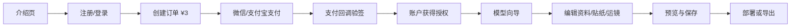

# SEN 3D Resume 模板产品方案与需求文档

版本：1.0-draft

## 1. 产品定义

SEN 3D Resume 是一套可将个人履历、作品与 GLB 三维角色整合成滚动叙事网站的模板产品。用户购买后，无需修改代码即可编辑个人内容、导入模型、调整贴纸和关键帧运镜，并部署自己的线上作品集。

产品的核心价值不是“提供一个 3D 页面”，而是让非技术创作者能在一小时内完成可分享的个人三维简历。

## 2. 当前状态与关键缺口

目前已具备：

- 3D 简历展示页及滚动驱动镜头。
- 模型导入与模型适配器的基础能力。
- 贴纸、关键帧运镜、个人资料三个可视化编辑器。
- 预设与自定义配置的保存接口。
- 产品介绍页、账户页与演示版 3 元解锁流程。

当前不能直接作为付费产品上线的原因：

- 账户仅存储于浏览器本地，不能跨设备登录，也不能找回密码。
- “解锁”仅是演示状态，没有真实支付、订单或支付回调验证。
- 编辑器依赖本地开发 API；静态部署后无法安全写入模型、配置或重新生成 GLB。
- 用户内容、模型文件、订单和授权没有服务端数据模型与权限控制。
- 缺少交付、部署、售后和版权边界。

## 3. 目标与非目标

### 目标

1. 用户可注册、支付 3 元并获得与账户绑定的编辑授权。
2. 用户可在浏览器内完成个人资料、贴纸、运镜与模型配置编辑。
3. 用户可预览、保存、导出或发布自己的作品集。
4. 用户可理解如何获得兼容的免费 GLB 模型并完成导入。

### 非目标（MVP 不做）

- 不做开放式 3D 建模、骨骼绑定或在线 Blender 替代品。
- 不保证任意 GLB 自动生成高质量镜头；复杂模型需要适配引导。
- 不提供“永久免费”的第三方模型生成服务；仅提供流程、提示词与兼容性校验。
- 不把 3 元支付包装成 SaaS 订阅，默认定义为一次性模板授权。

## 4. 用户与场景

| 用户 | 主要任务 | 成功标准 |
| --- | --- | --- |
| 求职者/学生 | 将履历变成可分享链接 | 60 分钟内发布第一版 |
| 设计师/创意开发者 | 用自己的 GLB 做作品集 | 能独立调镜头和内容 |
| 模板购买者 | 替换默认素材并部署 | 不需要接触源代码 |
| 运营管理员 | 管理订单、授权与用户问题 | 可定位订单和重发授权 |

## 5. 用户旅程

## 6. MVP 功能需求

### P0：账户、支付与授权

- 支持邮箱验证码登录，避免密码存储与找回流程。
- 账户中心展示邮箱、订单号、授权状态、购买时间和授权版本。
- 创建 3 元一次性支付订单，支持微信支付优先、支付宝备选。
- 服务端必须验证支付回调签名并以订单状态授予授权；前端不得决定授权结果。
- 订单幂等：同一支付回调重复到达不重复发放授权。
- 未授权用户可访问介绍页和演示工作台，但三个编辑器与完整提示词必须锁定。

验收：新用户付款成功后刷新、换设备登录仍可进入编辑器；伪造浏览器本地状态不能解锁。

### P0：项目与内容管理

- 每个账户创建一个默认项目，后续可扩展多项目。
- 个人资料编辑支持姓名、角色、简介、地点、社交链接、履历和作品条目。
- 所有编辑内容有“未保存 / 保存成功 / 保存失败”状态，保存到服务端。
- 支持恢复“预设 1”和最近一次保存版本。
- 作品预览必须与发布版使用同一份配置。

验收：清除浏览器缓存后，登录仍能恢复已保存内容。

### P0：模型上传与适配

- 支持上传 `.glb`，限制单文件大小、MIME 类型与模型数量。
- 上传后服务端或浏览器端执行基础检查：是否含相机、动画、骨骼、网格、文件大小和纹理数量。
- 向导引导用户设置主体节点、初始焦点、时间线焦点和作品焦点；缺失时给出明确降级行为。
- 保留官方预设模型，用户可随时切换回预设。
- 模型文件使用对象存储，生成临时访问 URL，不能写入前端仓库目录。

验收：上传一个不含官方命名节点的普通 GLB 时，用户能完成主体选择并看到可用预览或明确错误。

### P1：编辑器产品化

- 贴纸编辑器：添加、移动、缩放、旋转、删除、撤销/重做、保存。
- 运镜编辑器：时间线、关键帧新增/删除、X/Y/Z、焦点偏移、FOV、景深范围、虚化强度、预设 1、实时预览。
- 内容编辑器：表单校验、预设 1、实时预览、保存与恢复。
- 编辑入口统一在工作台左下工具菜单，避免页面常驻多个按钮。

验收：修改任意数值后，场景在 100ms 内出现肉眼可见的预览反馈；保存后刷新结果一致。

### P1：模型提示词与教程

- 解锁后展示“模型准备、生成、导出、导入、适配、常见问题”分步教程。
- 提供中文/英文正向提示词、反向提示词和“人物、物体、抽象形象”三套模板。
- 显示第三方工具的费用、条款和导出格式提示，避免承诺免费服务。
- 提供示例 GLB、兼容性检查清单和失败案例说明。

### P1：发布交付

- MVP 方案 A：导出项目配置和素材包，用户按教程部署至 Cloudflare Pages/GitHub Pages。
- 推荐方案 B：平台托管发布，为每个项目生成子域名/自定义域名绑定能力。
- 发布前检查缺失模型、未保存修改、过大资源和移动端适配。

## 7. 技术方案

### 前端

- 保留 React + React Three Fiber + TypeScript。
- 使用真正路由：`/` 介绍页，`/studio/:projectId` 工作台，`/account` 账户中心，`/guide` 已购教程。
- 将当前 zustand 编辑状态拆分为“本地草稿”和“服务端项目配置”。
- 大型 Three.js 依赖按路由懒加载，介绍页不加载 GLB 或编辑器代码。

### 后端与基础设施

- Next.js/Node API 或 Cloudflare Workers 作为 API 层。
- PostgreSQL：用户、项目、订单、授权、版本记录。
- 对象存储（R2/S3）：GLB、贴纸、封面及导出产物。
- 鉴权：邮箱验证码或第三方 OAuth；会话 Cookie 使用 HttpOnly、Secure、SameSite。
- 支付：接入合规聚合支付服务或微信支付/支付宝官方接口；所有密钥置于服务端环境变量。
- 队列/异步任务：模型检查、缩略图生成、GLB 重新打包与导出。

### 核心数据模型

| 实体 | 核心字段 |
| --- | --- |
| User | id、email、createdAt |
| Project | id、userId、name、profileConfig、directorConfig、status |
| Asset | id、projectId、type、storageKey、metadata、size |
| Order | id、userId、amount、currency、provider、providerOrderId、status |
| License | id、userId、productCode、orderId、grantedAt、status |
| Revision | id、projectId、configSnapshot、createdAt、createdBy |

## 8. 非功能需求

- 安全：上传文件白名单、大小限制、恶意文件扫描、支付回调验签、速率限制、审计日志。
- 性能：介绍页 LCP 小于 2.5 秒；模型采用压缩、按需加载和缩略图；移动端可降级后处理。
- 兼容：桌面 Chrome/Safari/Edge 与主流移动浏览器；对低性能设备关闭景深和 Bloom。
- 隐私：上传的人像/模型属于用户内容，不用于训练；提供删除项目和账户数据的入口。
- 可用性：保存失败可重试；长任务提供进度；资源上传断线可恢复。

## 9. 商业与运营规则

- 售卖对象：一次性数字模板授权，默认限制为购买者个人项目使用。
- 明确不转让官方默认角色、示例素材和第三方工具素材的版权。
- 商品页必须展示退款规则、支持范围、第三方模型工具免责声明与隐私政策。
- 建议初期价格：3 元作为内测验证价；正式版根据托管与支持成本调整为“模板授权”和“托管发布”两档。

## 10. 里程碑与优先级

| 阶段 | 交付物 | 完成标准 |
| --- | --- | --- |
| 0. 产品验证 | 介绍页、演示工作台、咨询入口 | 收集 20 个意向用户 |
| 1. 交易闭环 | 登录、订单、支付回调、授权 | 可真实完成购买与跨设备解锁 |
| 2. 编辑闭环 | 云端项目、上传模型、保存/版本 | 用户可独立做出并保存作品 |
| 3. 交付闭环 | 部署/托管、教程、客服流程 | 用户可得到公开访问链接 |
| 4. 增长优化 | 数据埋点、漏斗、邀请与案例 | 根据转化数据迭代定价和引导 |

## 11. 指标与验收

- 注册转化率：介绍页访问到注册不少于 8%。
- 支付转化率：注册到支付成功不少于 15%。
- 首次完成率：付款用户在 24 小时内完成保存项目不少于 60%。
- 发布完成率：付款用户在 7 天内获得公开链接不少于 35%。
- 支持成本：每 100 个付款用户人工介入不超过 15 次。

## 12. 上线前决策

以下事项必须由产品负责人确认后才进入真实上线：

1. 支付主体与渠道：个人主体、个体工商户或公司主体决定可用支付产品和结算方式。
2. 交付方式：只卖源码模板，还是提供云端托管；两者的成本、权限与退款规则不同。
3. 授权范围：个人、商用、客户项目、可创建项目数和是否允许二次分发。
4. 用户模型数据保存期限与删除策略。
5. 客服与退款承诺，以及模型兼容性支持边界。
