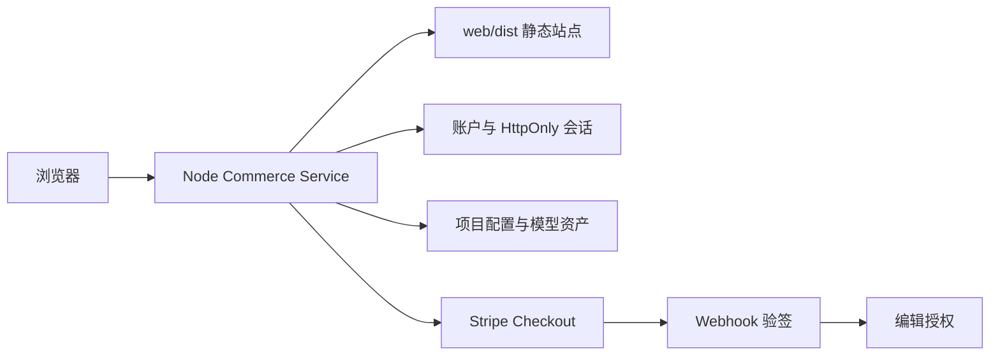

# SEN 3D Resume 技术实施与部署指南

## 已实现架构



服务端入口是 `server/commerce-server.mjs`。它服务构建后的前端，并提供以下 API：

| API | 用途 |
| --- | --- |
| `POST /api/auth/register` | 注册并写入 HttpOnly 会话 Cookie |
| `POST /api/auth/login` / `logout` | 登录和退出 |
| `GET /api/auth/session` | 获取当前账户及授权状态 |
| `GET/POST /api/profile` | 保存个人资料配置 |
| `GET/POST /api/director` | 保存关键帧运镜配置 |
| `GET/POST /api/stickers` | 保存贴纸参数配置 |
| `POST /api/models/upload` | 上传不超过 50 MB 的 GLB |
| `POST /api/payments/checkout` | 创建 ¥3 Stripe Checkout 订单 |
| `POST /api/payments/webhook/stripe` | 验签后将订单转换为授权 |

## 本地运行

第一个终端启动 Commerce API：

```powershell
cd server
node commerce-server.mjs
```

第二个终端启动前端开发环境：

```powershell
cd web
npm run dev
```

开发环境中 Vite 会将 `/api` 和 `/assets` 代理到 `127.0.0.1:8787`。生产环境先构建，再由服务端直接托管：

```powershell
cd web
npm run build
cd ..\server
node commerce-server.mjs
```

生产访问地址默认为 `http://127.0.0.1:8787`，应通过 Nginx、Caddy、Cloudflare Tunnel 或托管平台绑定 HTTPS 域名。

## 生产环境变量

复制 `server/.env.example` 为部署平台的环境变量配置。生产环境必须设置：

| 变量 | 说明 |
| --- | --- |
| `NODE_ENV=production` | 启用 Secure Cookie 并禁止开发默认密钥 |
| `APP_ORIGIN` | 用户实际访问的 HTTPS 域名，例如 `https://resume.example.com` |
| `SESSION_SECRET` | 32 字节以上随机字符串，用于签发会话 |
| `STRIPE_SECRET_KEY` | Stripe 服务端密钥，仅保存在服务端 |
| `STRIPE_WEBHOOK_SECRET` | Stripe Endpoint 的签名密钥 |
| `RESUME_PRICE_CENTS=300` | 人民币分，等于 3 元 |

可用以下方式生成会话密钥：

```powershell
node -e "console.log(require('crypto').randomBytes(32).toString('base64url'))"
```

## Stripe 配置

1. 在 Stripe Dashboard 创建账户并确认该账户支持 CNY 收款。
2. 将 `STRIPE_SECRET_KEY` 配置在部署平台环境变量中。
3. 新建 Webhook Endpoint：`https://你的域名/api/payments/webhook/stripe`。
4. 订阅事件 `checkout.session.completed`，将 Endpoint signing secret 配置为 `STRIPE_WEBHOOK_SECRET`。
5. 使用 Stripe Test Mode 完成一次支付。只有 Webhook 验签通过且 `payment_status=paid` 时，服务端才创建 `active` 授权。

当前实现故意不提供“支付成功前端直接解锁”的后门。没有 `STRIPE_SECRET_KEY` 时，创建订单会失败并向用户显示配置错误。

## 中国境内支付

Stripe 是否可用于人民币实际收款取决于商户主体所在地与账户能力。若目标用户主要在中国大陆，建议保留当前订单、授权和 Webhook 接口，将 `stripeCheckout` 替换为微信支付、支付宝或合规聚合支付渠道的适配器。

替换时必须保持以下规则：

- 订单金额和商品信息仅由服务端创建。
- 支付结果只以支付平台回调的验签结果为准。
- 回调需要幂等处理，同一订单不得重复授权。
- 私钥、证书和商户 API Key 不得进入前端构建产物或 Git。

## 数据与扩展边界

当前 MVP 使用 `data/commerce.json` 和 `data/assets/`，适合单实例演示、内测和低并发部署。正式商业化前应迁移：

| 当前 | 正式方案 |
| --- | --- |
| JSON 文件 | PostgreSQL / Supabase Postgres |
| 本地 assets 目录 | S3、Cloudflare R2 或 Vercel Blob |
| 单实例文件锁 | 数据库事务与订单唯一索引 |
| 本地 GLB 上传 | 对象存储预签名上传和异步模型检查 |

迁移时保持 API contract 不变，前端无需改写。贴纸烘焙与 GLB 重打包需要 Python/Blender 或容器 Worker，不应在 Web 请求线程直接执行。

## 上线检查

- [ ] 已配置 HTTPS 与正式 `APP_ORIGIN`。
- [ ] `SESSION_SECRET` 为随机生产值。
- [ ] Stripe Webhook 使用真实签名密钥并完成测试支付。
- [ ] 已设置文件备份、日志和监控。
- [ ] 已发布隐私政策、数字商品退款规则与模型版权说明。
- [ ] 已将数据层与资产层迁移到托管服务，再开放给真实用户。
