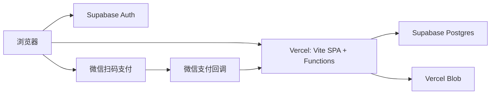

# SEN 3D Resume 部署与服务指南

本项目的线上架构采用 Vercel、Supabase 与微信支付，不再使用旧的本地 JSON Commerce Service 或 Stripe。



## 数据职责

| 数据 | 存放位置 |
| --- | --- |
| 用户注册、登录会话 | Supabase Auth |
| 个人信息、运镜关键帧、贴纸位置、已选模型 | `sen_projects`（Supabase Postgres） |
| 订单与编辑授权 | `sen_orders`、`sen_licenses`（Supabase Postgres） |
| GLB 和用户上传的贴纸图片 | Vercel Blob |

授权由微信支付的服务端签名回调写入 `sen_licenses`。前端无法自行标记已付款；所有编辑写入和文件上传都会二次检查该授权。

## 初始化 Supabase

1. 新建 Supabase 项目，在 SQL Editor 执行 [sen-3d-schema.sql](../supabase/sen-3d-schema.sql)。
2. 在 Authentication 中启用 Email 登录，并在 URL Configuration 中加入生产域名的 `/account` 回调地址。
3. 在 Vercel 项目环境变量中添加 `SUPABASE_URL`、`SUPABASE_SERVICE_ROLE_KEY`，并添加可公开的 `VITE_SUPABASE_URL`、`VITE_SUPABASE_ANON_KEY`。

`SUPABASE_SERVICE_ROLE_KEY` 只提供给 Vercel Function，绝不能使用 `VITE_` 前缀或提交到 Git。

## 配置微信支付

本项目使用微信支付 API v3 的 Native Payment 模式：账户页面生成支付二维码，用户用微信扫码；微信支付随后请求 `/api/payments/wechat/notify`。

在 Vercel 环境变量中设置 [`.env.example`](../web/.env.example) 内所有 `WECHATPAY_*` 项：商户号、AppID、商户证书序列号、商户私钥、平台公钥、API v3 密钥和正式 HTTPS 回调 URL。`WECHATPAY_AMOUNT_FEN=300` 即人民币 3 元。

部署后，在微信支付商户平台将回调 URL 指向：

```text
https://你的域名/api/payments/wechat/notify
```

只有平台签名验证通过、解密成功、交易状态为 `SUCCESS` 且金额与订单相符时，服务端才会将订单置为 `paid` 并写入授权。回调采用幂等 upsert，重复通知不会重复授权。

## 部署到 Vercel

1. 在 Vercel 导入 GitHub 仓库。
2. 将 **Root Directory** 设置为 `web`。
3. Build Command 使用 `npm run build`，Output Directory 使用 `dist`。
4. 连接 Vercel Blob Storage，获得并配置 `BLOB_READ_WRITE_TOKEN`。
5. 填入 `.env.example` 中的 Supabase 与微信支付变量后部署。

`web/vercel.json` 已将 `/studio`、`/account` 等 SPA 路由重写到 `index.html`，并保留 `/api/*` 给 Vercel Functions，因此不会再出现构建 CSS/JS 被模型文件路由误拦截的 404。

本地只预览前端可以使用 `npm run dev`。需要本地联调 Vercel Functions 时使用 Vercel CLI 的 `vercel dev`，并提供相同的环境变量。

## 支付冒烟测试

不使用真实商户凭据或真实扣款时，可执行：

```bash
cd web
npm run test:payment
```

该自动化测试模拟一次 ¥3 成功回调、重复回调和金额不匹配回调，验证订单状态与授权的核心规则。它不替代已配置微信商户凭据后的沙箱/真实环境联调。

## 当前边界

在线贴纸编辑器将图片存入 Blob，并持久化其可视化变换。将贴纸真正烘焙进 GLB 纹理需要 Blender/Python 的长时任务，不能可靠地在 Vercel 的短生命周期 Function 中运行；这应作为独立队列 Worker（例如容器任务）实现，而不是伪装成同步 HTTP 接口。
